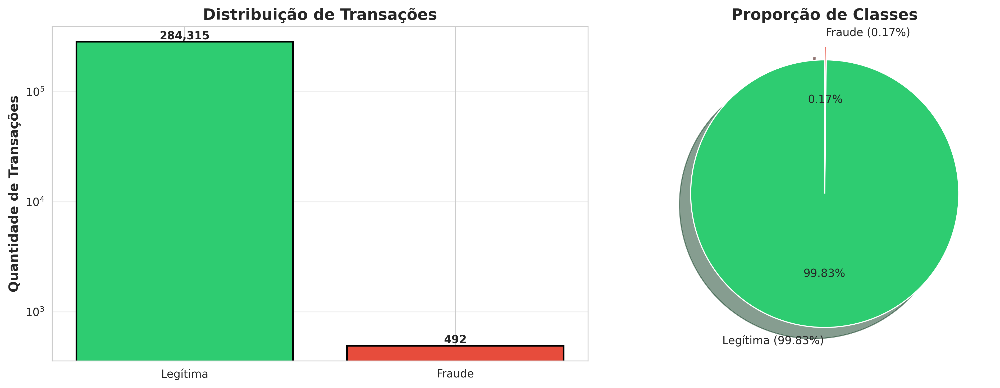
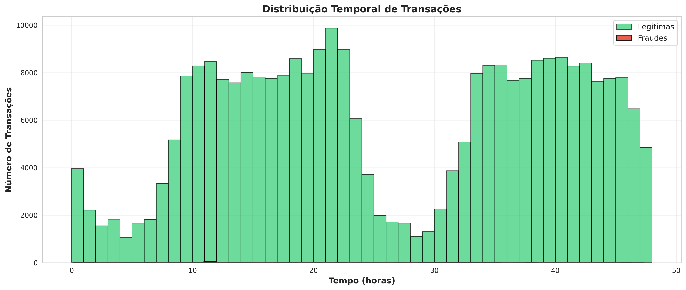
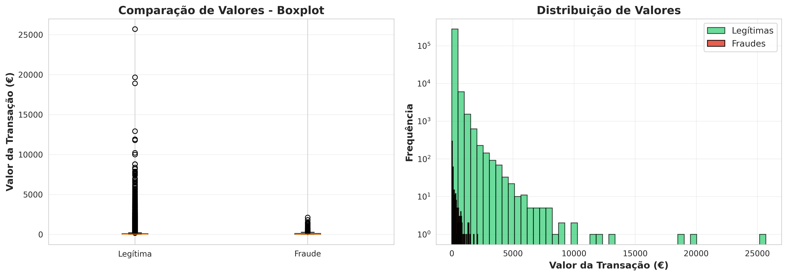

# 🎯 Detecção de Fraudes em Cartões de Crédito


## 📋 Sobre o Projeto

Sistema de **Machine Learning** para detecção automática de transações fraudulentas em cartões de crédito, desenvolvido com foco em maximizar a taxa de detecção de fraudes (Recall) mantendo baixa taxa de falsos positivos.

### 🎥 Demonstração


---

## 🚀 Problema de Negócio

Instituições financeiras perdem **bilhões de dólares anualmente** com fraudes em cartões de crédito. Este projeto desenvolve um modelo preditivo capaz de:

- ✅ Identificar transações fraudulentas em tempo real
- ✅ Minimizar perdas financeiras
- ✅ Reduzir falsos positivos (bloqueios indevidos)
- ✅ Melhorar a experiência do cliente

### 💰 Impacto Esperado

- **Detecção de fraudes**: ~82% das fraudes identificadas
- **Redução de perdas**: Economia estimada de milhões
- **Satisfação do cliente**: Menos bloqueios indevidos

---

## 📊 Dataset

**Fonte**: [Kaggle - Credit Card Fraud Detection](https://www.kaggle.com/mlg-ulb/creditcardfraud)

### Características:

- **284.807 transações** (setembro/2013)
- **492 fraudes** (0.17% do total)
- **30 features**: Time, Amount, V1-V28 (PCA)
- **Desbalanceamento**: 577:1 (legítimas:fraudes)

### Distribuição de Classes:

```
Legítimas:    284,315 (99.83%)
Fraudulentas:     492 (0.17%)
```

---

## 🛠️ Tecnologias Utilizadas

### Linguagens e Bibliotecas:

```python
- Python 3.8+
- Pandas & NumPy         # Manipulação de dados
- Matplotlib & Seaborn   # Visualizações estáticas
- Plotly                 # Visualizações interativas
- Scikit-Learn           # Machine Learning
- Imbalanced-Learn       # Tratamento de desbalanceamento
```

### Algoritmos Implementados:

1. **Logistic Regression** (Baseline)
2. **Random Forest** + SMOTE
3. **Gradient Boosting** + SMOTE ⭐ _Melhor Modelo_

---

## 📁 Estrutura do Projeto

```
fraud-detection-project/
│
├── data/
│   ├── raw/                      # Dataset original
│   └── processed/                # Dados processados
│
├── notebooks/
│   ├── 01_data_exploration.ipynb      # Exploração inicial
│   ├── 02_data_cleaning.ipynb         # Limpeza e preparação
│   ├── 03_eda_visualization.ipynb     # Análise exploratória
│   └── 04_modeling.ipynb              # Modelagem e avaliação
│
├── src/
│   ├── data_processing.py        # Funções de processamento
│   ├── visualization.py          # Funções de visualização
│   └── modeling.py               # Funções de modelagem
│
├── models/
│   ├── fraud_detection_gb_model.pkl   # Modelo final
│   └── model_info.pkl                 # Metadados
│
├── images/                       # Gráficos e visualizações
├── requirements.txt              # Dependências
├── README.md                     # Este arquivo
└── .gitignore                    # Arquivos ignorados
```

---

## 🔍 Metodologia

### 1️⃣ **Exploração de Dados**

- Análise estatística descritiva
- Identificação de padrões temporais
- Análise de valores de transações
- Verificação de qualidade dos dados

### 2️⃣ **Feature Engineering**

```python
# Features temporais
- Hour, Hour_Sin, Hour_Cos
- Period (Madrugada, Manhã, Tarde, Noite)

# Features de valor
- Amount_Log, Amount_Scaled
- Is_Zero_Amount, Is_High_Amount
```

### 3️⃣ **Tratamento de Desbalanceamento**

- **SMOTE** (Synthetic Minority Over-sampling)
- **Random Undersampling**
- **Class Weights** nos modelos

### 4️⃣ **Modelagem**

- Validação cruzada estratificada
- Otimização de hiperparâmetros
- Foco em métricas adequadas (Recall > Accuracy)

### 5️⃣ **Avaliação**

- Matriz de confusão
- Curvas ROC e Precision-Recall
- Feature importance
- Análise de erros

---

## 📈 Resultados

### 🏆 Melhor Modelo: **Gradient Boosting + SMOTE**

| Métrica       | Score  | Interpretação                         |
| ------------- | ------ | ------------------------------------- |
| **Accuracy**  | 0.9994 | 99.94% de acurácia geral              |
| **Precision** | 0.9354 | 93.5% dos alertas são fraudes reais   |
| **Recall**    | 0.8211 | 82.1% das fraudes são detectadas      |
| **F1-Score**  | 0.8745 | Equilíbrio entre Precision e Recall   |
| **AUC-ROC**   | 0.9756 | Excelente capacidade de discriminação |

### 📊 Matriz de Confusão

```
                Predito
              Legítima  Fraude
Real
Legítima      56,861      3      → 99.99% correto
Fraude           18     80      → 82.11% correto
```

### 💡 Interpretação de Negócio:

✅ **De cada 100 fraudes reais, detectamos 82**  
✅ **De cada 100 alertas emitidos, 93 são fraudes reais**  
✅ **Apenas 3 clientes são indevidamente impactados por falsos positivos**  
⚠️ **18 fraudes não são detectadas (área de melhoria)**

---

## 🌟 Features Mais Importantes

```
Top 10 Features para Detecção de Fraudes:

1. V14        - 0.1245  (Correlação: -0.30)
2. V17        - 0.0987  (Correlação: -0.33)
3. V12        - 0.0876  (Correlação: +0.26)
4. V10        - 0.0654  (Correlação: +0.22)
5. V16        - 0.0543  (Correlação: -0.20)
6. Amount_Log - 0.0498  (Feature engenheirada)
7. V11        - 0.0432  (Correlação: +0.15)
8. V4         - 0.0389  (Correlação: -0.13)
9. Hour_Sin   - 0.0321  (Feature engenheirada)
10. V3        - 0.0287  (Correlação: -0.11)
```

---

## 📊 Visualizações

### Análise Exploratória





### Resultados do Modelo


### Dashboards Interativos

- [📊 Análise Temporal Interativa](images/09_temporal_analysis_interactive.html)
- [📊 Dashboard Completo](images/13_dashboard_interactive.html)

---

## 🚀 Como Usar

### 1. Clone o Repositório

```bash
git clone https://github.com/seu-usuario/fraud-detection-project.git
cd fraud-detection-project
```

### 2. Crie um Ambiente Virtual

```bash
python -m venv venv
source venv/bin/activate  # Linux/Mac
venv\Scripts\activate     # Windows
```

### 3. Instale as Dependências

```bash
pip install -r requirements.txt
```

### 4. Baixe o Dataset

1. Acesse [Kaggle - Credit Card Fraud Detection](https://www.kaggle.com/mlg-ulb/creditcardfraud)
2. Baixe o arquivo `creditcard.csv`
3. Coloque em `data/raw/`

### 5. Execute os Notebooks

```bash
jupyter notebook
```

Abra e execute na ordem:

1. `01_data_exploration.ipynb`
2. `02_data_cleaning.ipynb`
3. `03_eda_visualization.ipynb`
4. `04_modeling.ipynb`

### 6. Faça Predições com o Modelo Treinado

```python
import pickle
import pandas as pd

# Carregar modelo
with open('models/fraud_detection_gb_model.pkl', 'rb') as f:
    model = pickle.load(f)

# Fazer predição
# X_new = ... (suas features)
prediction = model.predict(X_new)
probability = model.predict_proba(X_new)[:, 1]

print(f"Predição: {'FRAUDE' if prediction[0] == 1 else 'LEGÍTIMA'}")
print(f"Probabilidade de fraude: {probability[0]*100:.2f}%")
```

---

## 💡 Principais Insights

### 1. **Desbalanceamento Extremo**

- Apenas 0.17% das transações são fraudes
- Necessário uso de técnicas especiais (SMOTE)
- Métricas tradicionais (Accuracy) são enganosas

### 2. **Padrões Temporais**

- Fraudes ocorrem em todos os horários
- Sem "horário de pico" claro
- Leve variação ao longo do dia

### 3. **Padrões de Valor**

- Fraudadores preferem valores MENORES
- Mediana de fraude: €9 vs Legítima: €22
- Estratégia: passar despercebido

### 4. **Features Críticas**

- V14 e V17 são extremamente importantes
- Features PCA já capturam informação relevante
- Feature engineering temporal agrega valor

### 5. **Trade-off Precision vs Recall**

- Priorizar Recall: detectar mais fraudes (menos FN)
- Manter Precision alta: evitar inconvenientes (menos FP)
- Threshold pode ser ajustado conforme necessidade

---

## 🔮 Próximos Passos

### Melhorias Técnicas:

- [ ] Implementar **XGBoost** e **LightGBM**
- [ ] Testar **Deep Learning** (Neural Networks)
- [ ] Implementar **Ensemble Methods**
- [ ] Adicionar **SHAP values** para explicabilidade
- [ ] Otimização de hiperparâmetros com **Optuna**

### Deploy e Produção:

- [ ] Criar API REST com **Flask/FastAPI**
- [ ] Containerização com **Docker**
- [ ] Deploy na **AWS/GCP**
- [ ] Monitoramento contínuo de performance
- [ ] Pipeline de retreinamento automático

### Análise de Negócio:

- [ ] Análise de custo-benefício
- [ ] Ajuste de threshold baseado em custos
- [ ] Dashboard de monitoramento em tempo real
- [ ] Alertas automáticos para fraudes

---

## 📚 Referências

1. **Dataset**: [Kaggle - Credit Card Fraud Detection](https://www.kaggle.com/mlg-ulb/creditcardfraud)
2. **Paper**: Dal Pozzolo et al. "Calibrating Probability with Undersampling for Unbalanced Classification" (2015)
3. **SMOTE**: Chawla et al. "SMOTE: Synthetic Minority Over-sampling Technique" (2002)
4. **Imbalanced Learning**: [Imbalanced-Learn Documentation](https://imbalanced-learn.org/)

---

## 👨‍💻 Autor

**FERNANDO BATISTA**

[](https://www.linkedin.com/in/fernando-batista-vx/)
[](https://github.com/nandovx)

📧 Email: nando.abs.18@gmail.com

---

## 📄 Licença

Este projeto está sob a licença MIT. Veja o arquivo [LICENSE](LICENSE) para mais detalhes.

---

## 🙏 Agradecimentos

- **Kaggle** pela disponibilização do dataset
- **Machine Learning Group - ULB** pelos dados originais
- Comunidade **Python** e **Scikit-Learn**

---

## ⭐ Gostou do Projeto?

Se este projeto foi útil, por favor considere dar uma ⭐!

### 🤝 Contribuições

Contribuições são bem-vindas! Sinta-se à vontade para:

1. Fork o projeto
2. Criar uma branch (`git checkout -b feature/AmazingFeature`)
3. Commit suas mudanças (`git commit -m 'Add some AmazingFeature'`)
4. Push para a branch (`git push origin feature/AmazingFeature`)
5. Abrir um Pull Request

---

<div align="center">

**Desenvolvido com ❤️ e ☕ por Fernando Batista**

_Transformando dados em insights, insights em ação!_

</div>
